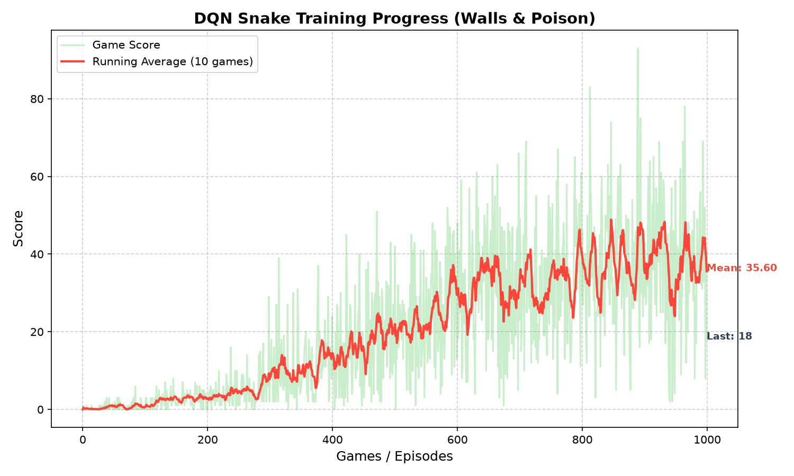
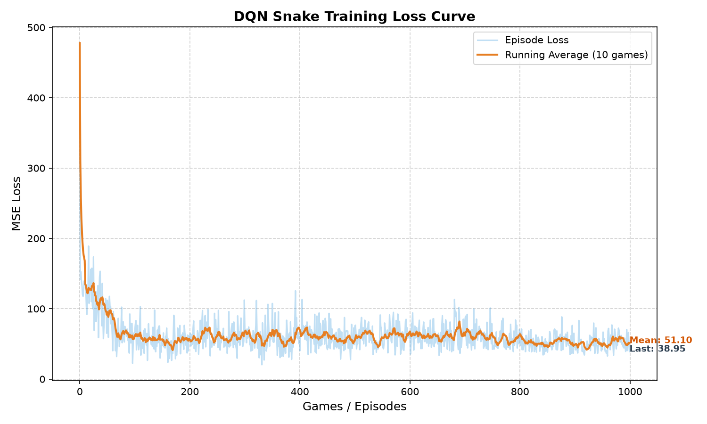

# Reinforcement Learning Snake Agent

This project implements a DQN RL agent to play the snake game on a custom 20x20 wrapping grid environment. Poison, food, and walls are generated randomly. The reward function gives -200 for eating itself or hitting a wall, +50 for food, and -20 for poison.

To improve policy performance, the implementation includes:

1. Potential-Based Reward Shaping: Rewards moving closer to the food at each step using the negative wrapping distance. The shaping reward added to the step is calculated as (gamma * -new_distance) - (-old_distance) with a gamma of 0.97, guiding the agent without altering the optimal policy.
2. 3-Directional Lidar: Provides vision by projecting raycasts in straight, left, and right directions to measure proximity (1.0 / distance) to walls, body segments, or poison.
3. BFS Path Check: Performs a breadth-first search from the head on each step to check for topological connectivity, preventing the snake from trapping itself in dead-ends.
4. Tail-popping Physics: Removes the tail segment before verifying collisions so the snake can safely follow its own body.

The stack used is PyTorch and Gymnasium for RL, and Pygame for GUI rendering.

## Neural Network to Predict Q-values

- Input: 12 values representing Lidar readings, BFS check status, heading direction, and relative food direction.
- Hidden Layers: 256 ReLU units to 256 ReLU units.
- Output Layer: 3 units representing action values for straight, turn right, and turn left.

## Training Process and Results

The policy trained over 1000 episodes using epsilon-greedy exploration. The performance metrics are:
- Max score: 83 (count of food eaten before failing)
- Final running average: 44.7
- Peak exploitation average: 51.4



### Loss Curve



The loss curve tracks the Mean Squared Error (MSE) loss over the 1000 training episodes:
- **Initial High Loss**: Starts around 477.8 during early exploration as the agent frequently hits walls or poison (-200 penalty).
- **Stability and Convergence**: Quickly drops and stabilizes smoothly between 35 and 60 (finishing at 38.95), showing that Q-value estimates converged without exploding.
- **No Reward Hacking**: The steady loss alongside continuous score improvement confirms stable learning without looping or reward farming.

## How to Run

1. Set up a virtual environment and activate it:
```bash
python3 -m venv venv
source venv/bin/activate
```

2. Install dependencies:
```bash
pip install -r requirements.txt
```

3. Train the model:
```bash
python train.py
```

4. Watch the trained model play:
```bash
python play.py
```
